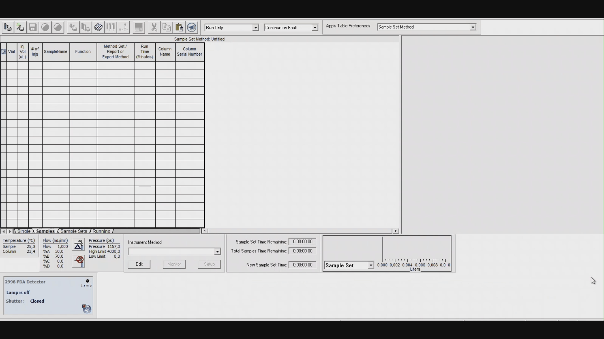
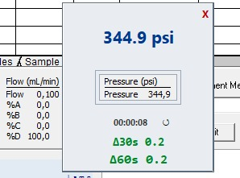

# Alliance Delta Monitor


## Overview

OCR-based pressure monitoring tool for **Waters Alliance HPLC instruments**.

This tool reads the **pressure value displayed in the instrument software** using OCR and calculates pressure deltas over **30 and 60 seconds (PSI)** to help detect pressure instability during operation.

The program runs as a lightweight **transparent overlay window** that can be positioned over the instrument software interface.

🇧🇷 Portuguese version available in [LEIAME.md](LEIAME.md)

## Demo

<p align="center">
  
</p>

---
# Disclaimer

This software is a **personal project** created to meet specific needs in my workflow.  
It is **not an official product of Waters Corporation**, and there is no sponsorship, partnership, or affiliation with the company.  
Use of this software is at your own risk, and it **does not replace or modify any official Empower 3 functionality**.

---

# Security Notice

This application captures **only a small region of the screen** in order to perform OCR on the pressure value displayed by the instrument software.

- No screenshots are stored  
- No data is logged  
- No information is transmitted externally  
- The program operates **entirely locally**

---


# Features

- Real-time **OCR pressure reading**
- Pressure **delta calculation over 30 seconds and 60 seconds**
- Transparent overlay window
- Resettable runtime timer
- Lightweight GUI built with **Tkinter**
- Standalone Windows executable
- Runs entirely **offline**

---

# How to Use

### 1. Open the Instrument Status window

In the Empower 3 software, open the **Instrument Status** panel.

This window can usually be accessed through one of the following menu paths:

**Option 1**

View → Instrument Status / Control Panel

**Option 2**

Instrument → Tools → Diagnostics → Instrument Status

---

### 2. Start the monitor

Run:

```
AllianceDeltaMonitor.exe
```

A small **transparent overlay window** will appear.

---

### 3. Align the reading area

Move the overlay window so that the capture area is positioned over the **Pressure (psi)** value displayed in the Instrument Status window.

Alignment guidelines:

- The monitored value is **Pressure (psi)**.
- Align the capture area with the **numeric pressure value**.
- If necessary, prioritize capturing the **numbers themselves**, even if the text label *"Pressure (psi)"* is partially outside the capture area.
- Make sure the numbers are **clearly visible and unobstructed**.

Once aligned correctly, the software will automatically begin reading the pressure and calculating deltas.

---

# Reset Button

The **Reset** button performs two actions:

1. **Resets the runtime timer**
2. **Clears the pressure history used for delta calculations**

After pressing Reset, the application begins a **new monitoring cycle**, recalculating the **30-second and 60-second pressure deltas** from the new readings.

---

# Screenshot

Example interface:




---

# Running the Python Version

Install dependencies:

```
pip install -r requirements.txt
```

Run the program:

```
python delta_pressure.py
```

---

# Standalone Executable

A compiled Windows executable is available in the **Releases** section.

Download:

```
AllianceDeltaMonitor.exe
```

No Python installation is required.

---

# Build the Executable

To build the executable manually using PyInstaller:

```
pyinstaller --noconfirm --windowed \
--name AllianceDeltaMonitor \
--icon=delta.ico \
--version-file build_tools/version.txt \
--add-data "tesseract;tesseract" \
--add-data "delta.ico;." \
delta_pressure.py
```

---

# Troubleshooting

### OCR not reading the pressure correctly

Try the following:

- Ensure the **pressure numbers are clearly visible**
- Avoid overlapping windows
- Align the capture area closer to the **numeric value**
- Ensure sufficient **screen contrast**

OCR accuracy depends on the visibility and clarity of the numbers on screen.

---

# Author

Lucas Albuquerque

---

# License

This project is licensed under the **MIT License**.
